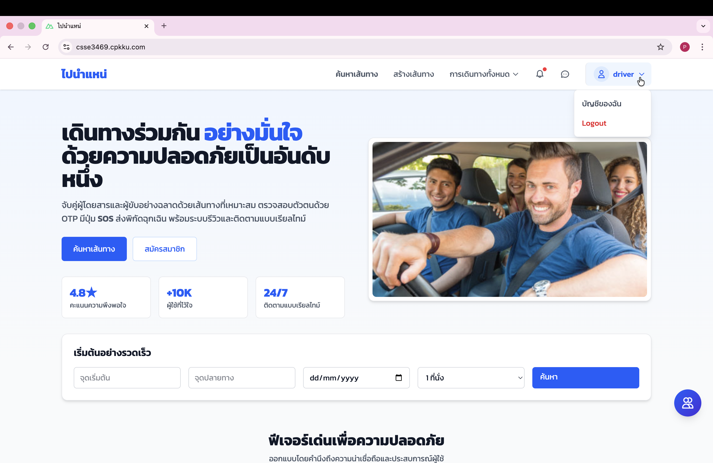
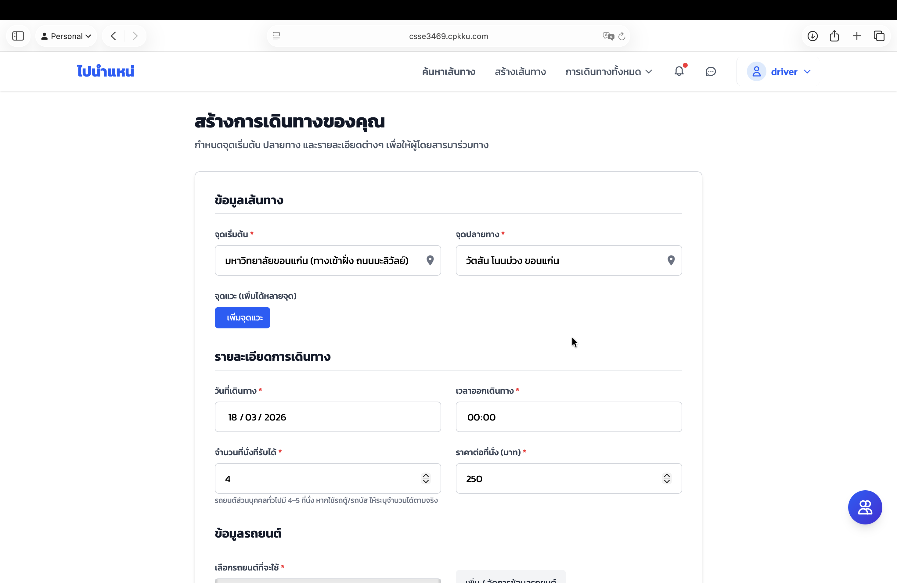
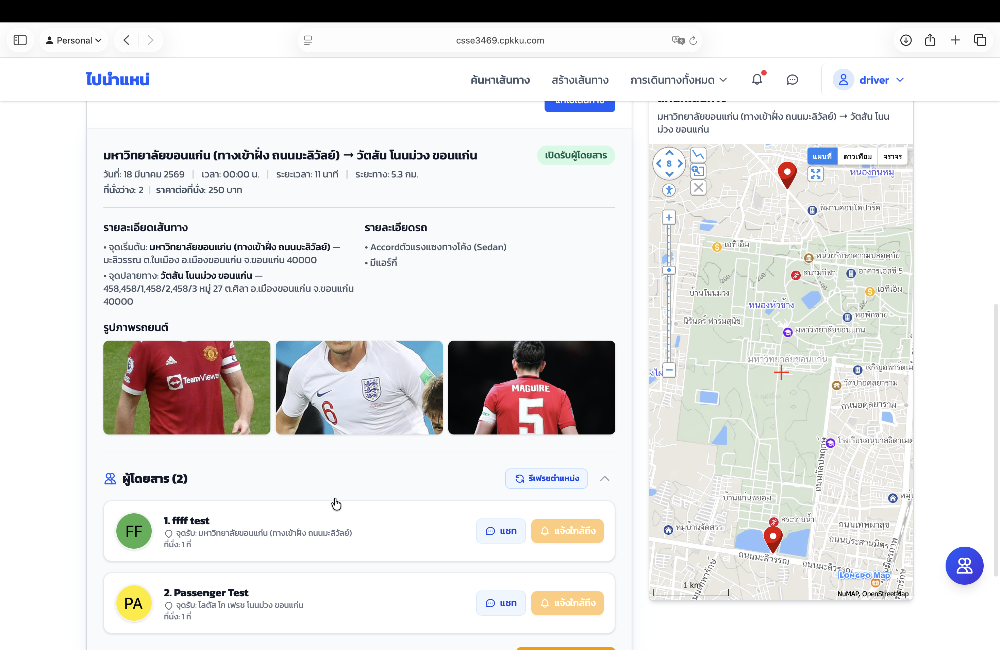
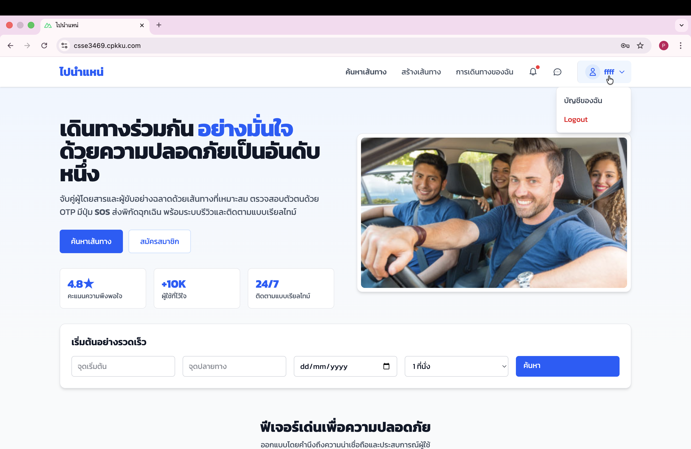
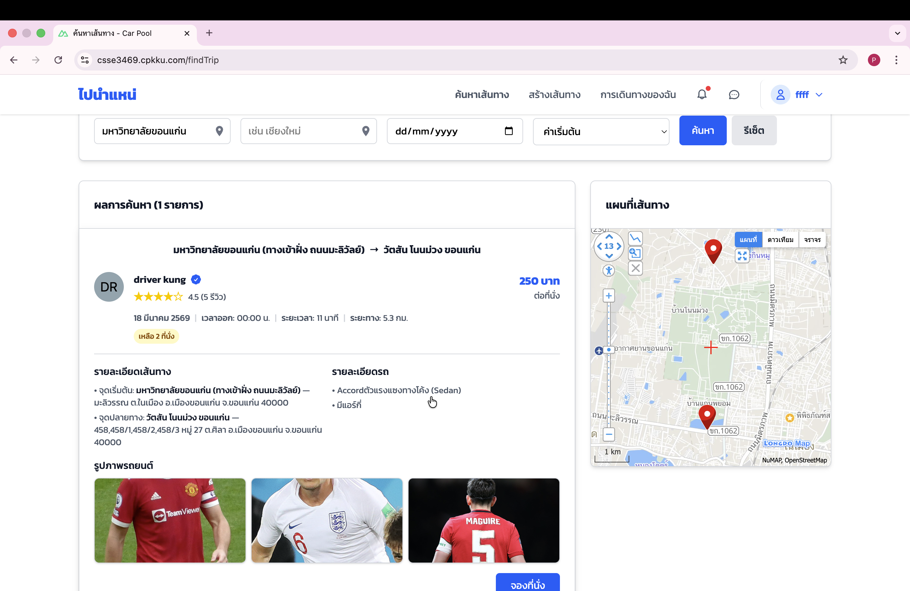
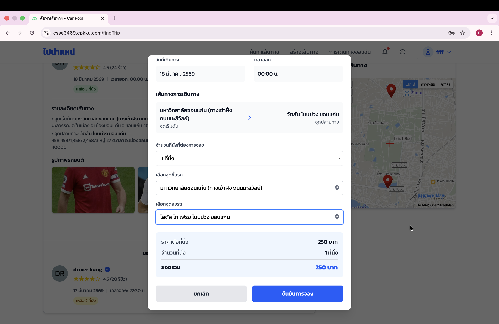
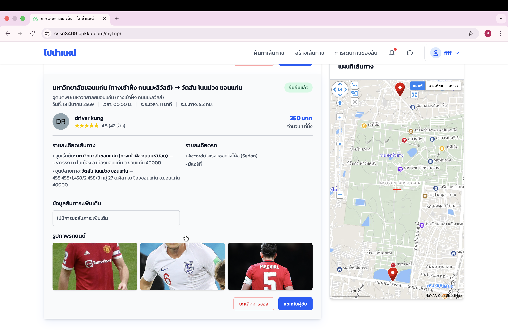
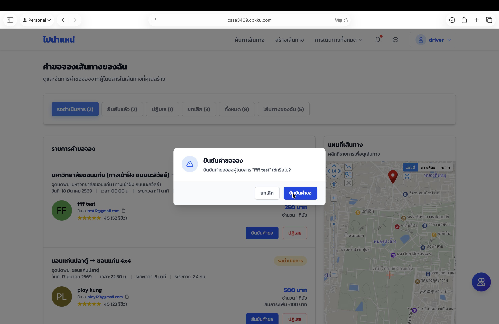
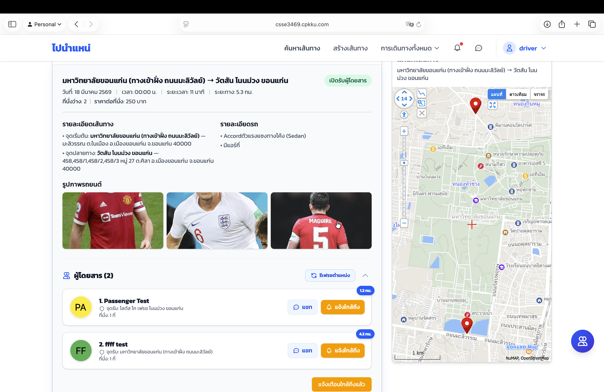

# คู่มือการใช้งานระบบ (User Manual)

📌 **ลิ้งค์งานของโปรเจคกลุ่ม:** [CS Group 4](https://csse3469.cpkku.com)

---

## 1. การแจ้งเตือนผู้โดยสารก่อนถึงจุดรับ

1. สร้างเส้นทางด้วยบัญชีผู้ขับขี่
- เข้าสู่ระบบด้วยบัญชี Driver

- สร้างเส้นทางใหม่ในระบบ

   
2. จองเส้นทางด้วยบัญชีผู้โดยสาร
- เข้าสู่ระบบด้วยบัญชี Passenger 

- เลือกเส้นทางที่ต้องการจอง

- เลือกจุดขึ้นลง

- คำขอสำเร็จ

3. ตรวจสอบตำแหน่งก่อนแจ้งเตือน
- Driver รับคำขอจองเส้นทาง 

- เปิดหน้า **Hub** ที่มุมขวาล่าง
- กดปุ่ม **Refresh** เพื่ออัปเดตตำแหน่งล่าสุด หากผู้โดยสารอยู่ในระยะที่กำหนด ปุ่มแจ้งเตือนจะเปลี่ยนเป็น **สีเหลือง** 

4. ส่งการแจ้งเตือน
- กดปุ่ม **แจ้งเตือน** เพื่อส่งการแจ้งเตือนไปยังผู้โดยสาร

### ข้อควรระวัง
- จุดรับต้องอยู่ภายในระยะ 5 กิโลเมตร  
- ตรวจสอบว่าเปิด Notification และเสียงแจ้งเตือนของอุปกรณ์แล้ว 