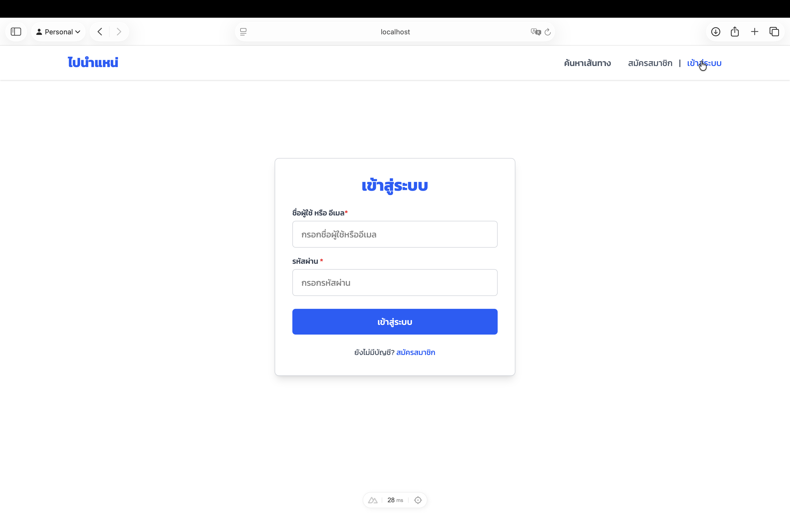
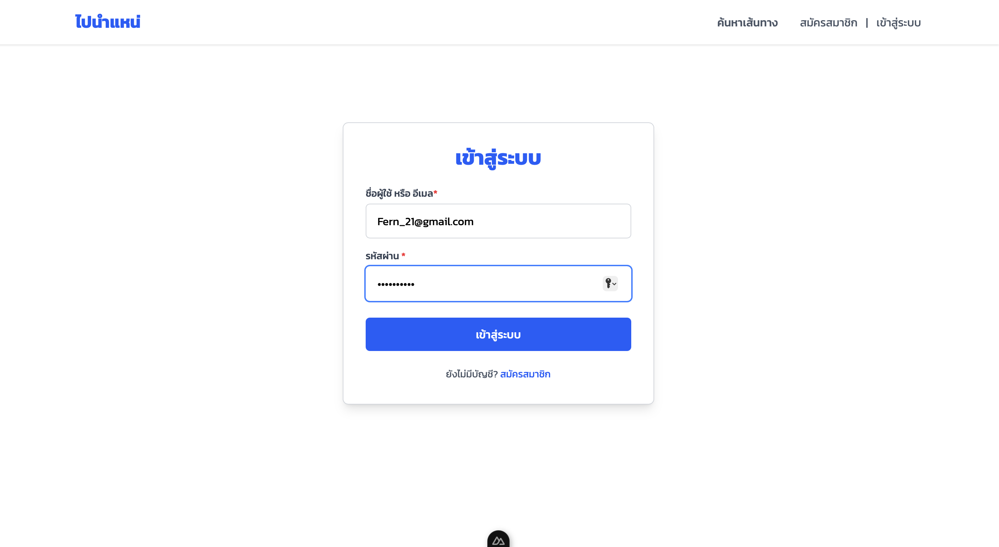
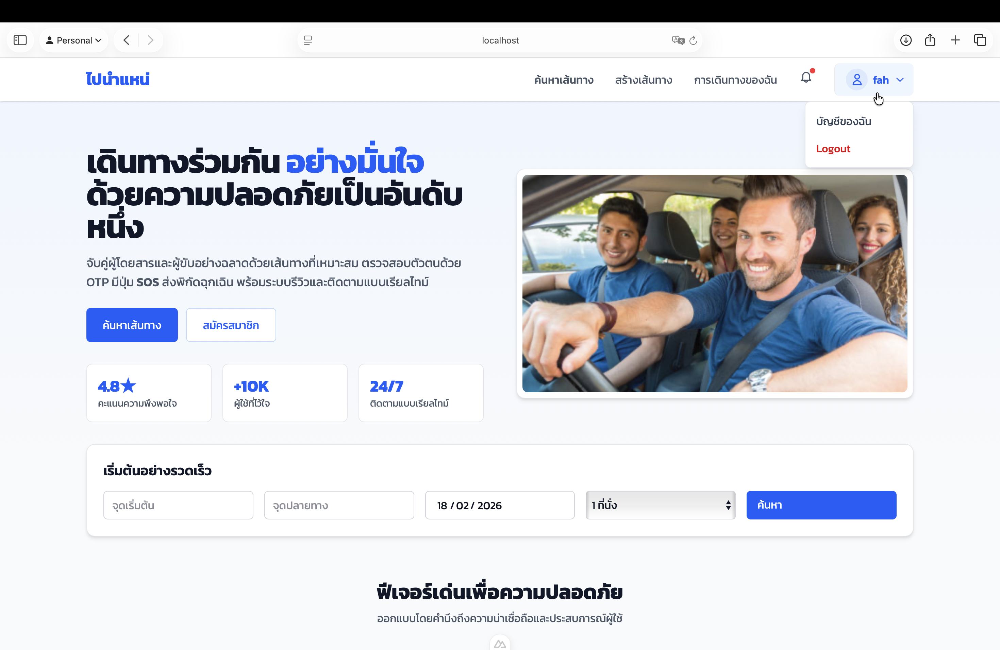
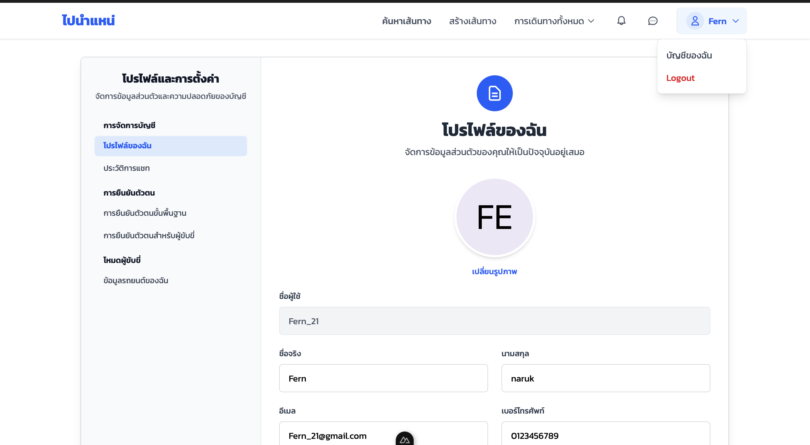
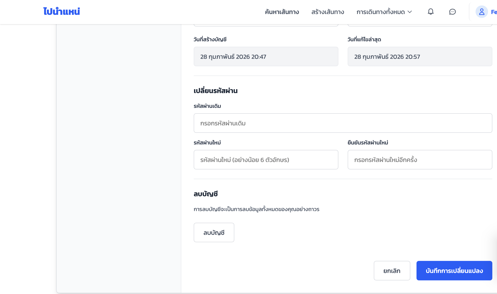
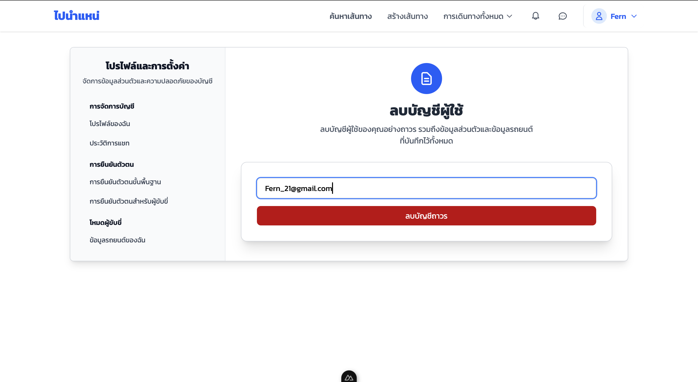
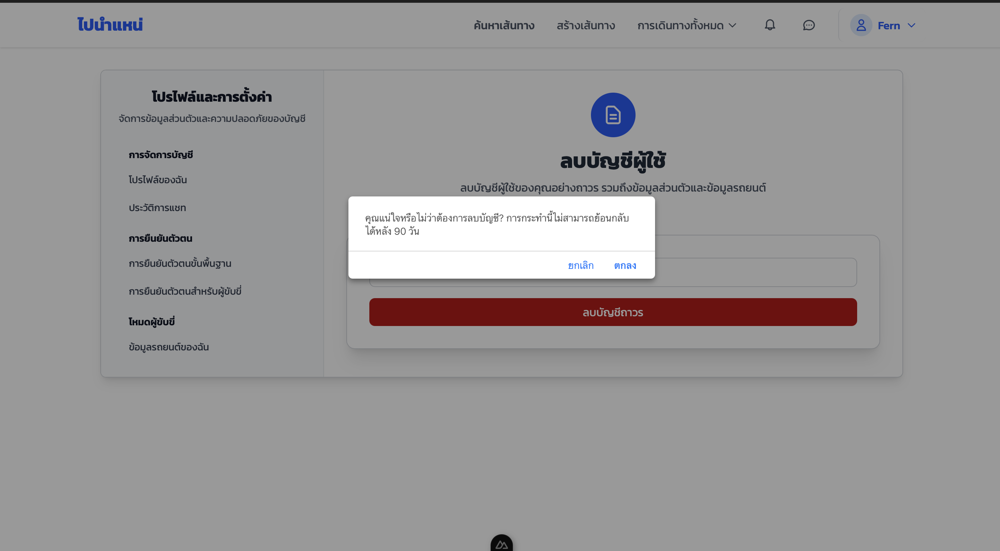
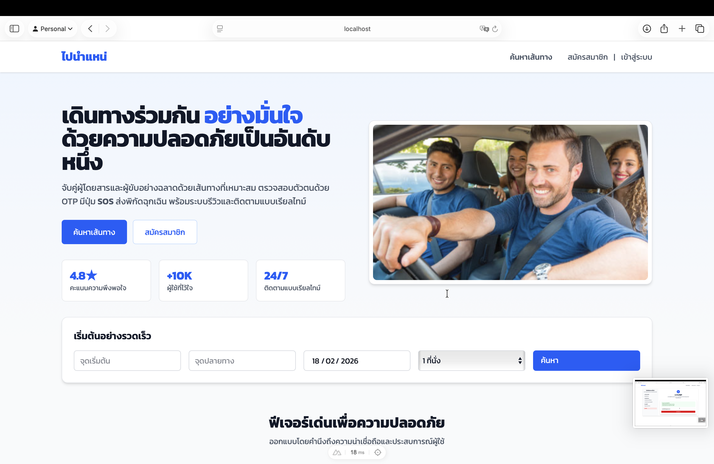

# คู่มือการใช้งานระบบ (User Manual)

📌 **ลิ้งค์งานของโปรเจคกลุ่ม:** [CS Group 4](https://csse3469.cpkku.com)

---

## 1. ลบบัญชีผู้ใช้

1. เข้าสู่ระบบและไปที่เมนู **โปรไฟล์และการตั้งค่า (Profile & Settings)** 
  

   
2. เลือกหัวข้อ **ลบบัญชี** ทางแถบเมนูด้านซ้าย  
  
  

3. ผู้ใช้ต้องกรอก **อีเมลของตนเอง** เพื่อยืนยันการลบบัญชี  
  
  

4. กดปุ่ม **ลบบัญชี** เพื่อดำเนินการยืนยันการลบบัญชีผู้ใช้ 
  

5. เมื่อดำเนินการสำเร็จ บัญชีผู้ใช้จะถูก **ปิดการใช้งานทันที**  
   และข้อมูลทั้งหมดจะถูกลบออกจากระบบอย่างถาวรภายในระยะเวลา **90 วัน**
     
     

### ข้อควรระวัง
- หลังจากส่งคำขอลบบัญชี ผู้ใช้จะไม่สามารถใช้งานบัญชีเดิมได้อีก  
- ข้อมูลทั้งหมดจะถูกลบออกจากระบบอย่างถาวรภายในระยะเวลา **90 วัน** และไม่สามารถกู้คืนได้หลังจากพ้นระยะเวลาดังกล่าว

