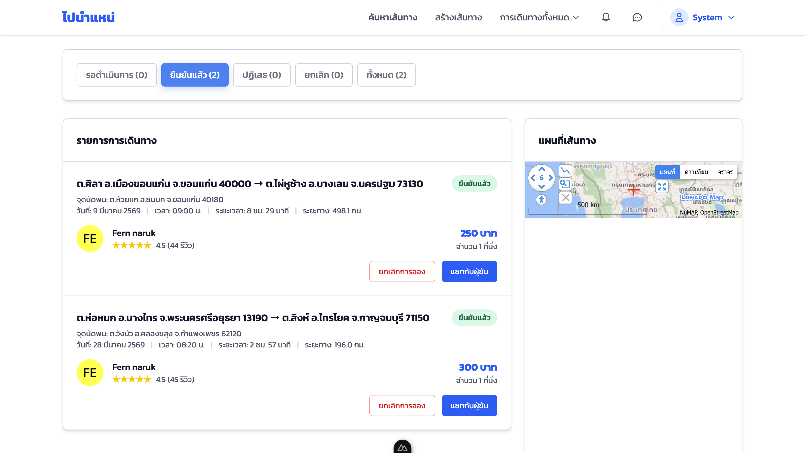
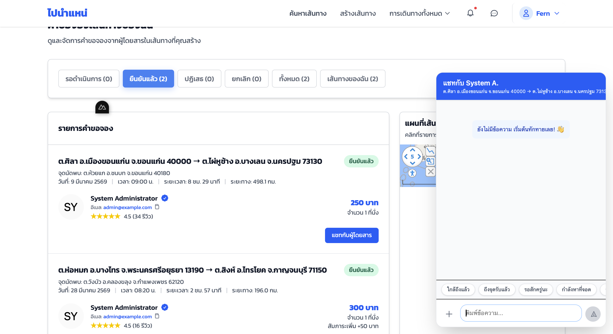
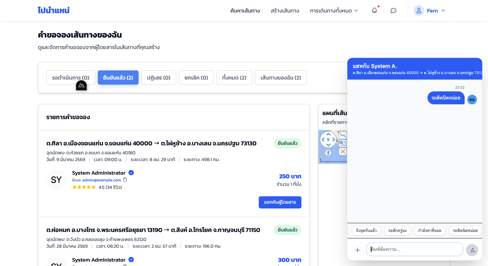
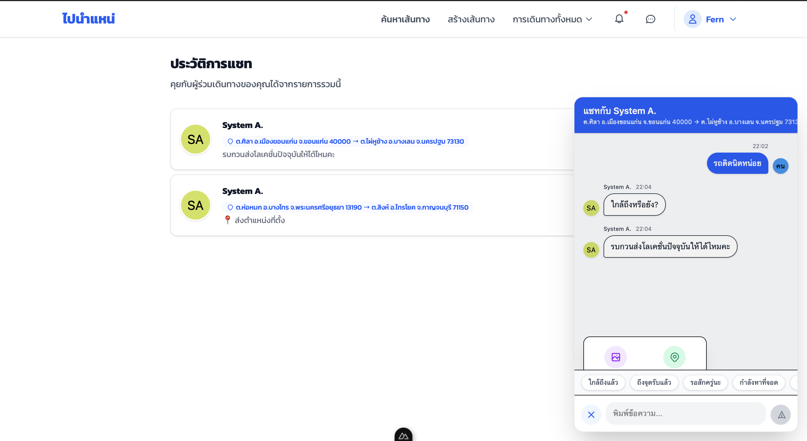
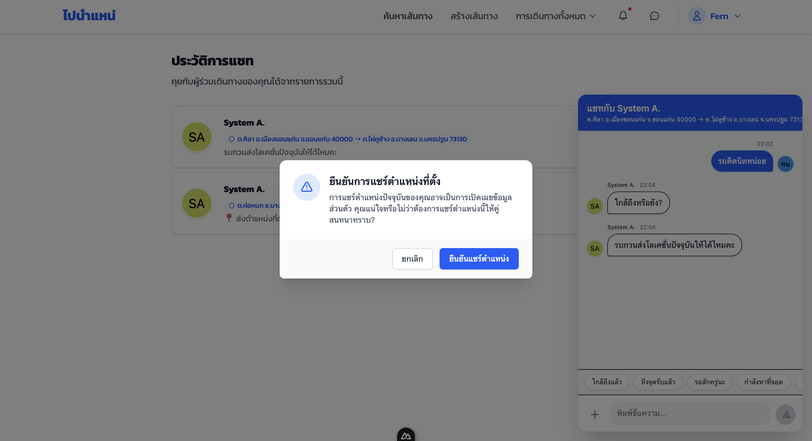
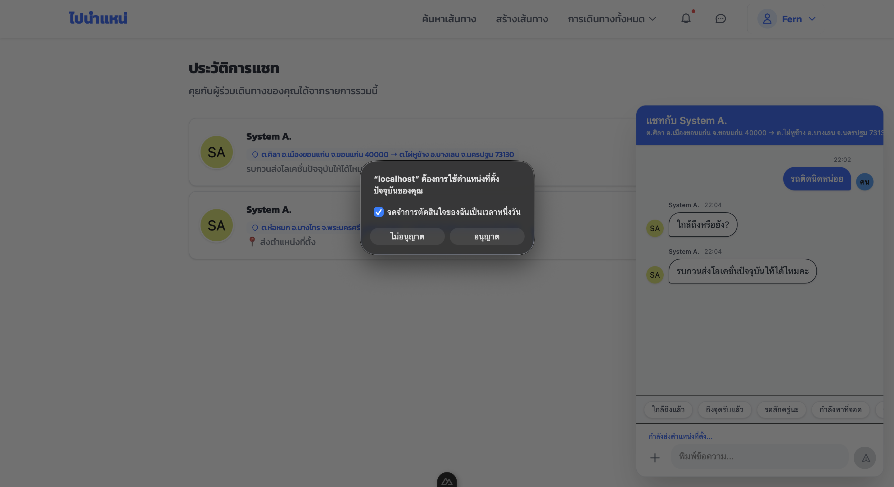
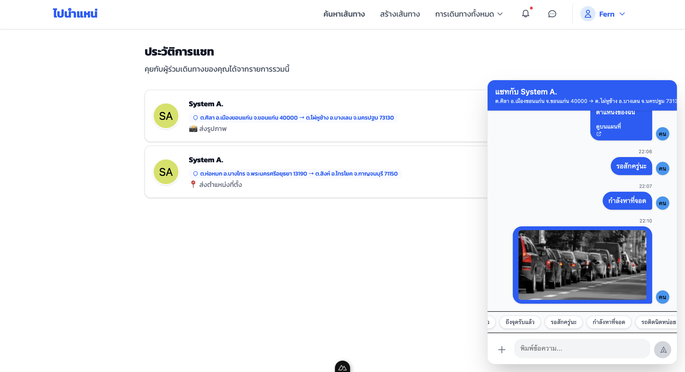

# คู่มือการใช้งานระบบ (User Manual)
 **ลิ้งค์งานของโปรเจคกลุ่ม:** (https://csse3469.cpkku.com)

---

## 1.ระบบส่งข้อความภายในแอปที่ปลอดภัยสำหรับคนขับและผู้โดยสาร
คู่มือนี้จัดทำขึ้นเพื่ออธิบายวิธีการใช้งานระบบแชทภายในแอป 
เพื่อให้คนขับ (Driver) และผู้โดยสาร (Passenger) สามารถสื่อสารกันได้อย่างปลอดภัย 
โดยไม่เปิดเผยข้อมูลส่วนตัว

---

## 2. วิธีเข้าใช้งานระบบแชท Driver: การใช้งานระบบแชทกับผู้โดยสาร

1. เข้าสู่หน้าคำขอจองที่ได้รับการยืนยัน
    หลังจากคำขอจองถูกยืนยันแล้ว ในหน้ารายการ คำขอจองเส้นทางของฉัน ระบบจะแสดงปุ่ม แชทกับผู้โดยสาร และไอคอน ประวัติการแชท อยู่ภายในหน้าเดียวกัน เพื่อให้ Driver สามารถติดต่อกับ Passenger ได้ทันที

      

2. เปิดหน้าการสนทนา
    เมื่อ Driver กดปุ่ม แชทกับผู้โดยสาร ระบบจะแสดงหน้าห้องแชท ซึ่งในกรณีที่ยังไม่มีการสนทนา ข้อความในห้องแชทจะยังว่างอยู่

      

3. ใช้ข้อความอัตโนมัติ
    ในหน้าห้องแชท ระบบมีข้อความอัตโนมัติที่ Driver สามารถเลือกส่งให้ Passenger ได้อย่างรวดเร็ว เช่น
- ใกล้ถึงแล้ว
- ถึงจุดรับแล้ว
- รอสักครู่นะ
- กำลังหาที่จอด
- รถติดนิดหน่อย
    Driver สามารถกดเลือกข้อความที่ต้องการ แล้วส่งไปยัง Passenger ได้ทันที

    

4. กดปุ่ม "Chat" เพื่อเข้าสู่ห้องแชท
    Driver สามารถส่งข้อมูลเพิ่มเติมเพื่อแจ้งสถานะการเดินทางให้ Passenger ทราบได้ โดยสามารถ
- ส่งข้อความ
- ส่งตำแหน่งปัจจุบัน (Location)
- ส่งรูปภาพเกี่ยวกับการเดินทาง
    เพื่อให้ Passenger ทราบสถานการณ์หรือจุดที่ Driver อยู่ในปัจจุบัน

   

5. การส่งตำแหน่งปัจจุบัน (Location)
    เมื่อ Driver กดปุ่ม ส่งโลเคชั่น

  

    ระบบจะแสดงหน้าต่าง ยืนยันการแชร์ตำแหน่งครั้งที่ 1
- หากกด ไม่อนุญาต หรือ ยกเลิก ระบบจะกลับไปยังหน้าก่อนหน้า

  

- หากกด อนุญาต ระบบจะแสดงหน้าต่าง ยืนยันการแชร์ตำแหน่งครั้งที่ 2
    เมื่อ Driver กด อนุญาต อีกครั้ง ตำแหน่งปัจจุบันของ Driver จะถูกส่งไปยัง Passenger

  

6. การส่งรูปภาพ
    Driver สามารถกดปุ่ม ส่งรูปภาพ เพื่อส่งภาพที่เกี่ยวข้องกับการเดินทาง 

  

    เช่น
- ตำแหน่งรถ
- จุดรับผู้โดยสาร
- สถานการณ์ระหว่างทาง
    หลังจากเลือกภาพแล้ว รูปภาพจะถูกส่งไปยัง Passenger ภายในห้องแชททันที
    

---

## 3. ความปลอดภัยและความเป็นส่วนตัว

- ระบบไม่แสดงเบอร์โทรศัพท์หรืออีเมลของผู้ใช้งาน
- ใช้ชื่อแสดงผล (Display Name) แทนข้อมูลจริง
- เฉพาะผู้ที่อยู่ใน Booking เดียวกันเท่านั้นที่สามารถแชทได้
- มีการยืนยันตัวตนผ่านระบบก่อนเข้าถึงแชท

---

## 4. ข้อจำกัดของระบบ

- ใช้งานได้เฉพาะ Booking ที่มีสถานะ CONFIRMED
- ไม่สามารถส่งไฟล์นอกจากรูปภาพ

---

## หมายเหตุ
**ไม่สามารถส่งข้อความได้**
- ตรวจสอบการเชื่อมต่ออินเทอร์เน็ต
- ตรวจสอบสถานะ Booking

**ไม่สามารถอัปโหลดรูปภาพได้**
- ตรวจสอบว่าเป็นไฟล์รูปภาพ