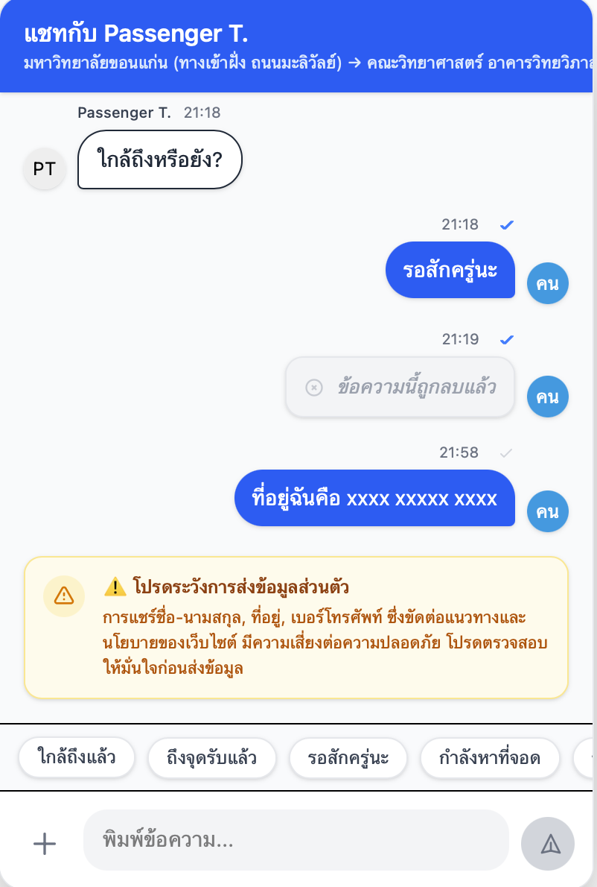
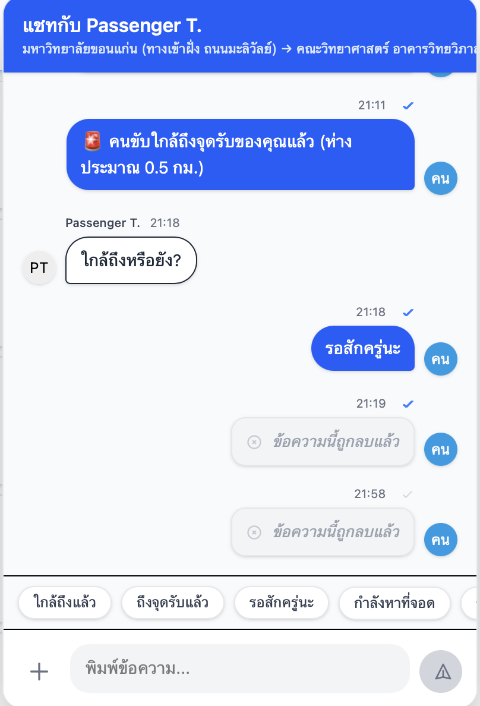

# เอกสารคู่มือการใช้งานระบบ (User Manual)

📌 **ลิ้งค์งานของโปรเจคกลุ่ม:** [CS Group 4](https://csse3469.cpkku.com)

# Pai Nam Nae - A Safe Ride Sharing App
รายวิชา : CP353004 Software Engineering

# จัดทำโดย
## สมาชิก
| ลำดับ | ชื่อ–นามสกุล | รหัสนักศึกษา | GitHub Username |
|------|--------------|--------------|-----------------|
| 1 | นายพงศ์สุพัฒน์ เดิมพันธ์ | 663380392-0 | @pongsupatrev |
| 2 | นายจักรพรรดิ ภวิจิตร | 663380377-6 | @6633803776 |
| 3 | นางสาวอมลธิรา เขาวงษ์ | 663380412-0 | @Amonthira |
| 4 | นางสาวตติยา  บุตรเฟื้อย | 663380594-8 | @TatiyaButfuay |
| 5 | นายปรเมศวร์ พุทธทองศรี | 663380606-7 | @porametpu |
| 6 | นางสาวภัทราวดี ส่องศรีโรจน์ | 663380610-6 | @Fahnueaeiei |

# สารบัญ
- [ส่วนที่ 1 การเพิ่มค่าใช้จ่ายกรณีมีสัมภาระเพิ่มเติม] (#ส่วนที่ 1 การเพิ่มค่าใช้จ่ายกรณีมีสัมภาระเพิ่มเติม)
- [ส่วนที่ 2 ระบบส่งข้อความภายในแอปที่ปลอดภัยสำหรับคนขับและผู้โดยสาร] (#ส่วนที่ 2 ระบบส่งข้อความภายในแอปที่ปลอดภัยสำหรับคนขับและผู้โดยสาร)

## ส่วนที่ 1 การเพิ่มค่าใช้จ่ายกรณีมีสัมภาระเพิ่มเติม

### 1. เพิ่มค่าใช้จ่ายกรณีมีสัมภาระ
1. เข้าสู่ระบบ
  

2.ไปที่เมนูสร้างเส่นทางและเลือกOptionค่าใช้จ่ายเพิ่มเติมที่ตรงกับที่ต้องการ
  

3.เมื่อผู้โดยสารต้องการจองที่นั่งก็จะสามารถเลือกได้ หากมีสัมภาระเกินปกติได้ตามที่ตนเองต้องการ 
พร้อมทั้งคำนวณจำนวนเงินที่ต้องจ่าย

### หมายเหตุ
- หากคนขับเลือก สัมภาระไม่เกิน24นิ้ว/ไม่เกิน20กก. ทางผู้โดยสารจะไม่สามารถเลือกสัมภาระที่มากกว่านั้นได้
- โปรดเลือกให้ถูกตามความเหมาะสม คนขับสามารถยกเลิกได้หากหน้างานไม่ตรงตามที่ตกลง

---

## ส่วนที่ 2 ระบบส่งข้อความภายในแอปที่ปลอดภัยสำหรับคนขับและผู้โดยสาร

### 1.ระบบส่งข้อความภายในแอปที่ปลอดภัยสำหรับคนขับและผู้โดยสาร
คู่มือนี้จัดทำขึ้นเพื่ออธิบายวิธีการใช้งานระบบแชทภายในแอป 
เพื่อให้คนขับ (Driver) และผู้โดยสาร (Passenger) สามารถสื่อสารกันได้อย่างปลอดภัย 
โดยไม่เปิดเผยข้อมูลส่วนตัว

---

### 2. วิธีเข้าใช้งานระบบแชท Driver: การใช้งานระบบแชทกับผู้โดยสาร

1. เข้าสู่หน้าคำขอจองที่ได้รับการยืนยัน
    หลังจากคำขอจองถูกยืนยันแล้ว ในหน้ารายการ คำขอจองเส้นทางของฉัน ระบบจะแสดงปุ่ม แชทกับผู้โดยสาร และไอคอน ประวัติการแชท อยู่ภายในหน้าเดียวกัน เพื่อให้ Driver สามารถติดต่อกับ Passenger ได้ทันที

      

2. เปิดหน้าการสนทนา
    เมื่อ Driver กดปุ่ม แชทกับผู้โดยสาร ระบบจะแสดงหน้าห้องแชท ซึ่งในกรณีที่ยังไม่มีการสนทนา ข้อความในห้องแชทจะยังว่างอยู่

      

3. ใช้ข้อความอัตโนมัติ
    ในหน้าห้องแชท ระบบมีข้อความอัตโนมัติที่ Driver สามารถเลือกส่งให้ Passenger ได้อย่างรวดเร็ว เช่น
- ใกล้ถึงแล้ว
- ถึงจุดรับแล้ว
- รอสักครู่นะ
- กำลังหาที่จอด
- รถติดนิดหน่อย
    Driver สามารถกดเลือกข้อความที่ต้องการ แล้วส่งไปยัง Passenger ได้ทันที

    

4. กดปุ่ม "Chat" เพื่อเข้าสู่ห้องแชท
    Driver สามารถส่งข้อมูลเพิ่มเติมเพื่อแจ้งสถานะการเดินทางให้ Passenger ทราบได้ โดยสามารถ
- ส่งข้อความ
- ส่งตำแหน่งปัจจุบัน (Location)
- ส่งรูปภาพเกี่ยวกับการเดินทาง
    เพื่อให้ Passenger ทราบสถานการณ์หรือจุดที่ Driver อยู่ในปัจจุบัน

   

5. การส่งตำแหน่งปัจจุบัน (Location)
    เมื่อ Driver กดปุ่ม ส่งโลเคชั่น

  

    ระบบจะแสดงหน้าต่าง ยืนยันการแชร์ตำแหน่งครั้งที่ 1
- หากกด ไม่อนุญาต หรือ ยกเลิก ระบบจะกลับไปยังหน้าก่อนหน้า

  

- หากกด อนุญาต ระบบจะแสดงหน้าต่าง ยืนยันการแชร์ตำแหน่งครั้งที่ 2
    เมื่อ Driver กด อนุญาต อีกครั้ง ตำแหน่งปัจจุบันของ Driver จะถูกส่งไปยัง Passenger

  

6. การส่งรูปภาพ
    Driver สามารถกดปุ่ม ส่งรูปภาพ เพื่อส่งภาพที่เกี่ยวข้องกับการเดินทาง 

  

    เช่น
- ตำแหน่งรถ
- จุดรับผู้โดยสาร
- สถานการณ์ระหว่างทาง
    หลังจากเลือกภาพแล้ว รูปภาพจะถูกส่งไปยัง Passenger ภายในห้องแชททันที
    

7. การตรวจจับคำที่ขัดต่อหลักชุมชน
    เมื่อมีผู้ใช้ไม่ว่าจะเป็นฝั่ง Driver หรือ Passenger หากมีข้อความที่ขัดต่อหลักชุมชนในช่องแชทจะขึ้นสถานะแจ้งเตือนเกี่ยวกับความปลอดภัย

  

8. การลบข้อความ
    กรณีที่ผู้ใช้ต้องการลบข้อความ สามารถกดลบข้อความได้ผ่านปุ่ม icon

  

    เมื่อผู้ใช้กดปุ่มลบข้อความและยืนยันการลบข้อความแล้ว
    ข้อความที่ถูกลบจะถูกเปลี่ยนเป็น "ข้อความนี้ถูกลบแล้ว"

  

---

### 3. ความปลอดภัยและความเป็นส่วนตัว

- ระบบไม่แสดงเบอร์โทรศัพท์หรืออีเมลของผู้ใช้งาน
- ใช้ชื่อแสดงผล (Display Name) แทนข้อมูลจริง
- เฉพาะผู้ที่อยู่ใน Booking เดียวกันเท่านั้นที่สามารถแชทได้
- มีการยืนยันตัวตนผ่านระบบก่อนเข้าถึงแชท
- มีข้อความแจ้งเตือนเมื่อผู้ใช้ส่งข้อความที่ขัดต่อ Community Guideline&Policy
- สามารถลบข้อความได้

---

### 4. ข้อจำกัดของระบบ

- ใช้งานได้เฉพาะ Booking ที่มีสถานะ CONFIRMED
- ไม่สามารถส่งไฟล์นอกจากรูปภาพ

---

### หมายเหตุ
**ไม่สามารถส่งข้อความได้**
- ตรวจสอบการเชื่อมต่ออินเทอร์เน็ต
- ตรวจสอบสถานะ Booking

**ไม่สามารถอัปโหลดรูปภาพได้**
- ตรวจสอบว่าเป็นไฟล์รูปภาพ

## ส่วนที่ 4 การลบบัญชีผู้ใช้

1. เข้าสู่ระบบและไปที่เมนู **โปรไฟล์และการตั้งค่า (Profile & Settings)** 
  

   
2. เลือกหัวข้อ **ลบบัญชี** ทางแถบเมนูด้านซ้าย  
  
  

3. ผู้ใช้ต้องกรอก **อีเมลของตนเอง** เพื่อยืนยันการลบบัญชี  
  
  

4. กดปุ่ม **ลบบัญชี** เพื่อดำเนินการยืนยันการลบบัญชีผู้ใช้ 
  

5. เมื่อดำเนินการสำเร็จ บัญชีผู้ใช้จะถูก **ปิดการใช้งานทันที**  
   และข้อมูลทั้งหมดจะถูกลบออกจากระบบอย่างถาวรภายในระยะเวลา **90 วัน**
     
     

6. กรณีที่ผู้ใช้มีการจองหรือมีเส้นทางที่กำลังดำเนินการอยู่ ระบบจะไม่อนุญาตให้ผู้ใช้นั้นทำการลบบัญชี

  

### ข้อควรระวัง
- หลังจากส่งคำขอลบบัญชี ผู้ใช้จะไม่สามารถใช้งานบัญชีเดิมได้อีก  
- ข้อมูลทั้งหมดจะถูกลบออกจากระบบอย่างถาวรภายในระยะเวลา **90 วัน** และไม่สามารถกู้คืนได้หลังจากพ้นระยะเวลาดังกล่าว
